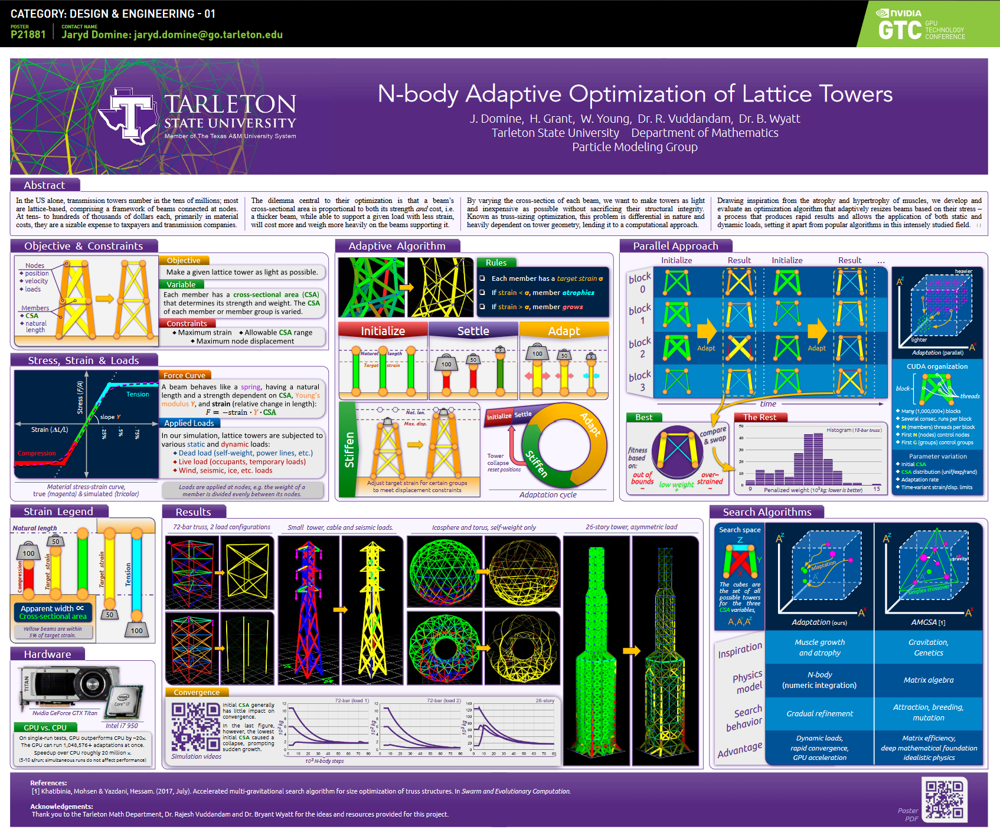

# Tower (Truss Optimization)

This project was accepted for poster presentation at Nvidia's GTC (GPU Techonology Conference) 2020! Due to the circumstances the conference was held digitally, but nonetheless we had the chance to share our work with many geat minds who appreciate parallel programming!

You can view the full PDF here: <a href="https://www.nvidia.com/content/dam/en-zz/Solutions/gtc/conference-posters/gtc2020-posters/Design_Engineering_01_P21881_Jaryd_Domine_Web.pdf">GTC 2020 Poster PDF</a>.

Video Presentation: https://www.youtube.com/watch?v=bRVauh85Y6E

Google Slides Link: https://docs.google.com/presentation/d/1cT3gzZa2DfHXu1K9kqxm2fBpttTe_aPl37HJD58NsPc/edit?usp=sharing

### Reward-Based Truss Optimization for Modern Applications

With the advance of 3D printing and other manufacturing techniques, the use of trusses in parts and structures has only grown in scope. And while their applications expand, the methods for optimizing them stay static – designed for static loads and conditions.

The weight optimization of trusses has saved millions of dollars in material costs for large-scale power transmission projects. We seek to optimize trusses for weight and strength under complex and dynamic conditions at any scale, to extend these benefits to other modern applications.

Inspired by the growth and atrophy of muscles, we develop and evaluate a truss sizing optimization algorithm that finds the optimal thickness for beams based on their stress – a process that produces rapid results and allows the application of both static and dynamic loads.
